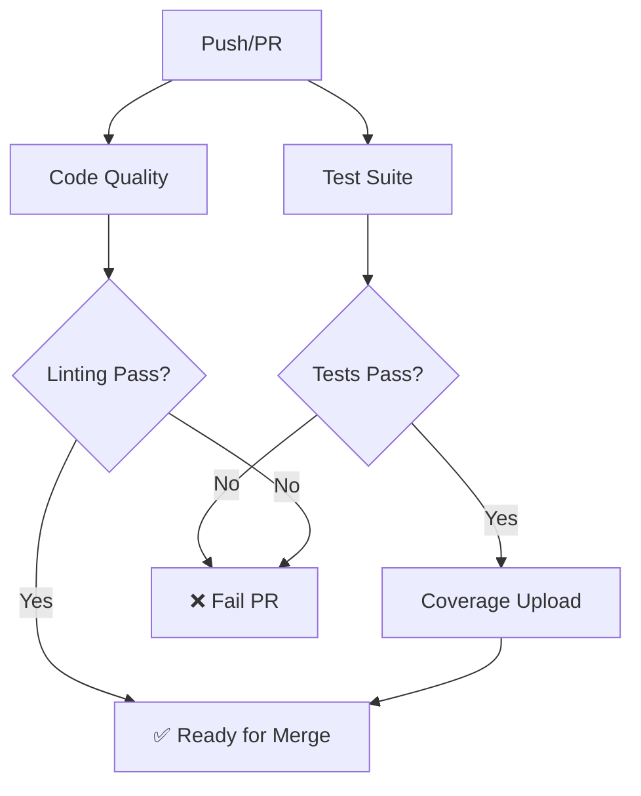
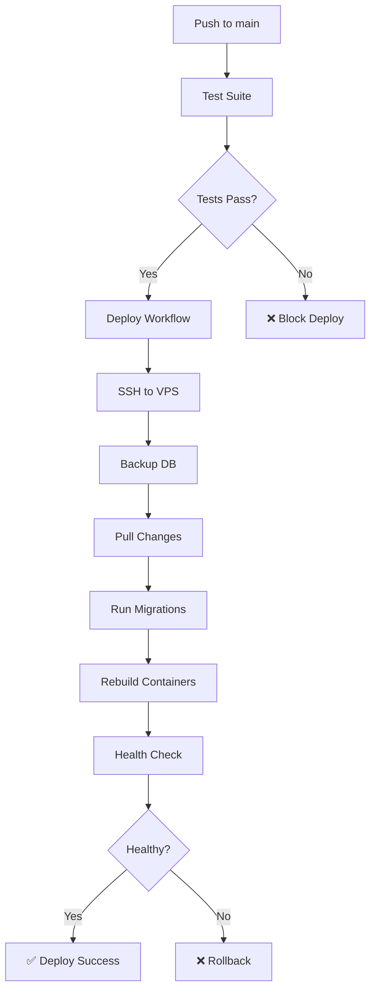

# CI/CD Guide - AI Strategy Hub

## Overview

Sistema CI/CD completo con GitHub Actions per automated testing, linting, security scanning e deployment.

---

## Workflows Disponibili

### 1. Test Suite (`test.yml`)

**Trigger**: Push e PR su `main` e `develop`

**Jobs**:

#### Backend Tests
- **Python 3.11** con PostgreSQL 15 e Redis 7
- Esegue migrations con Alembic
- Runs pytest con coverage >= 80%
- Upload coverage a Codecov
- Artifact: coverage reports e HTML

**Comandi eseguiti**:
```bash
cd backend
pytest \
  --cov=app \
  --cov-report=xml \
  --cov-report=term-missing \
  --cov-fail-under=80 \
  -v --tb=short --maxfail=5
```

#### Frontend Tests
- **Node.js 20** con npm
- Linting (ESLint)
- Type checking (TypeScript)
- Unit tests (Jest - quando implementati)
- Coverage upload a Codecov

**Comandi eseguiti**:
```bash
cd frontend
npm ci
npm run lint
npx tsc --noEmit
npm test -- --coverage --watchAll=false
```

#### Build Verification
- Verifica import backend corretti
- Build frontend completo
- Dependency check

#### Security Scanning
- **Trivy** vulnerability scanner
- **Safety** check per dipendenze Python
- Upload risultati a GitHub Security

#### Test Summary
- Aggrega risultati di tutti i job
- Fallisce se backend tests falliscono
- Report finale completo

**Status Badge**:
```markdown
[](https://github.com/bottodavide/AISH.EU/actions/workflows/test.yml)
```

---

### 2. Code Quality (`lint.yml`)

**Trigger**: Push e PR su `main` e `develop`

**Jobs**:

#### Backend Linting
- **Black**: Code formatting check
- **isort**: Import sorting check
- **Flake8**: Style guide enforcement (PEP 8)
- **MyPy**: Static type checking

**Configurazione Flake8**:
```
--max-line-length=120
--ignore=E203,W503,E501
```

**Comandi**:
```bash
cd backend
black --check --diff app/ tests/
isort --check-only --diff app/ tests/
flake8 app/ tests/
mypy app/
```

#### Frontend Linting
- **ESLint**: JavaScript/TypeScript linting
- **Prettier**: Code formatting check
- **TypeScript**: Compilation check

**Comandi**:
```bash
cd frontend
npm run lint
npx prettier --check "src/**/*.{ts,tsx,js,jsx,json,css}"
npx tsc --noEmit
```

**Status Badge**:
```markdown
[](https://github.com/bottodavide/AISH.EU/actions/workflows/lint.yml)
```

---

### 3. Deploy (`deploy.yml`)

**Trigger**:
- Push su `main`
- Tags `v*.*.*`
- Manual workflow dispatch

**Jobs**:

#### Deploy to VPS
- SSH connection al Linode VPS
- Pull latest changes da Git
- Backup database PostgreSQL
- Run Alembic migrations
- Docker rebuild e restart
- Health check post-deployment
- Cleanup old images

**Steps**:
1. Backup database: `/backup/db_YYYYMMDD_HHMMSS.sql`
2. `git pull origin main`
3. `alembic upgrade head`
4. `docker-compose build --no-cache`
5. `docker-compose up -d`
6. `curl -f http://localhost:8000/health`
7. `docker image prune -f`

#### Create Release (per tags)
- Automatic GitHub Release creation
- Tag format: `v1.0.0`, `v1.2.3`, etc.

**Secrets richiesti**:
```
DEPLOY_SSH_KEY    # SSH private key per VPS
VPS_HOST          # IP/hostname VPS
VPS_USER          # Username SSH
```

---

## Codecov Integration

**File**: `codecov.yml`

**Configurazione**:
- Target: 80% overall coverage
- Patch target: 75%
- Flags separati per backend/frontend
- Ignore: tests, migrations, venv, node_modules
- GitHub checks annotations attivi

**Coverage Badge**:
```markdown
[](https://codecov.io/gh/bottodavide/AISH.EU)
```

**Setup Codecov**:
1. Crea account su [codecov.io](https://codecov.io)
2. Collega repository GitHub
3. Copia token da Codecov dashboard
4. Aggiungi `CODECOV_TOKEN` ai GitHub Secrets

---

## GitHub Templates

### Pull Request Template

**Location**: `.github/PULL_REQUEST_TEMPLATE.md`

**Sezioni**:
- Description
- Type of Change
- Related Issues
- Changes Made
- Testing (coverage checklist)
- Screenshots
- Checklist (code review, docs, tests)
- Deployment Notes (migrations, env vars, breaking changes)

### Issue Templates

#### Bug Report
**Location**: `.github/ISSUE_TEMPLATE/bug_report.md`

**Sezioni**:
- Descrizione bug
- Steps per riprodurre
- Comportamento atteso/attuale
- Ambiente (OS, browser, versioni)
- Logs/error messages
- Possibile soluzione

#### Feature Request
**Location**: `.github/ISSUE_TEMPLATE/feature_request.md`

**Sezioni**:
- Descrizione feature
- Problema da risolvere
- Soluzione proposta
- Caso d'uso
- Benefici e impatto
- Mockup/wireframe
- Implementazione suggerita
- Considerazioni tecniche

---

## GitHub Secrets Required

### Per Testing & Coverage
```
CODECOV_TOKEN           # Token Codecov per upload coverage
```

### Per Deployment
```
DEPLOY_SSH_KEY          # SSH private key per accesso VPS
VPS_HOST                # IP o hostname del VPS Linode
VPS_USER                # Username SSH (es. root, deploy)
```

### Per Produzione (opzionali, gestiti su VPS)
```
# Questi secrets sono gestiti nel .env del VPS, non su GitHub
POSTGRES_PASSWORD
JWT_SECRET_KEY
STRIPE_SECRET_KEY
STRIPE_WEBHOOK_SECRET
MS_GRAPH_CLIENT_SECRET
CLAUDE_API_KEY
```

---

## Setup Completo

### 1. Configura Secrets su GitHub

```bash
# Vai su GitHub → Settings → Secrets and variables → Actions
# Aggiungi i seguenti secrets:

1. CODECOV_TOKEN (da codecov.io)
2. DEPLOY_SSH_KEY (generato con ssh-keygen)
3. VPS_HOST (IP del tuo Linode VPS)
4. VPS_USER (username SSH)
```

### 2. Configura Codecov

```bash
# 1. Registrati su codecov.io con GitHub
# 2. Autorizza repository AISH.EU
# 3. Copia token dalla dashboard
# 4. Aggiungi CODECOV_TOKEN ai GitHub Secrets
```

### 3. Configura SSH per Deploy

```bash
# Sul tuo computer locale
ssh-keygen -t ed25519 -C "github-actions-deploy" -f ~/.ssh/aish_deploy

# Copia chiave pubblica sul VPS
ssh-copy-id -i ~/.ssh/aish_deploy.pub user@vps-ip

# Aggiungi chiave privata ai GitHub Secrets
cat ~/.ssh/aish_deploy | pbcopy  # macOS
# Incolla in GitHub → DEPLOY_SSH_KEY
```

### 4. Prepara VPS per Deploy

```bash
# Sul VPS
cd /opt
git clone https://github.com/bottodavide/AISH.EU.git aistrategyhub
cd aistrategyhub

# Crea directory backup
mkdir -p /backup

# Setup docker-compose.yml se non esiste
# Setup .env production
```

### 5. Test Workflows

```bash
# Push su branch develop per testare CI
git checkout -b develop
git push origin develop

# Merge su main per testare CI + potenziale deploy
git checkout main
git merge develop
git push origin main

# Create release tag per testare deploy completo
git tag -a v1.0.0 -m "Release v1.0.0"
git push origin v1.0.0
```

---

## Workflow Execution Flow

### Per ogni Push/PR



### Deploy su Main



---

## Monitoring & Debugging

### Check Workflow Status

```bash
# Via GitHub CLI
gh run list
gh run view <run-id>
gh run watch

# Via Web
https://github.com/bottodavide/AISH.EU/actions
```

### Download Artifacts

```bash
# Coverage reports, test results
gh run download <run-id>

# O via web:
# Actions → Workflow run → Artifacts section
```

### Debug Failed Runs

```bash
# 1. Check logs nella Actions tab
# 2. Riprodurre localmente:

# Backend tests
cd backend
pytest -v --tb=short

# Frontend tests
cd frontend
npm test

# Linting
cd backend && black --check app/
cd frontend && npm run lint
```

### Common Issues

#### ❌ Database Connection Failed
```bash
# Verifica che PostgreSQL service sia up
# Check logs: "waiting for postgres to become ready"
# Soluzione: aumenta health check retries nel workflow
```

#### ❌ Coverage Below Threshold
```bash
# Errore: "coverage below 80%"
# Soluzione: aggiungi test per aumentare coverage
pytest --cov=app --cov-report=term-missing
```

#### ❌ Deploy SSH Failed
```bash
# Errore: "Permission denied (publickey)"
# Verifica DEPLOY_SSH_KEY secret
# Test SSH manualmente: ssh -i key user@host
```

#### ❌ Migration Failed
```bash
# Errore durante alembic upgrade
# Check migration conflicts
# Rollback se necessario: alembic downgrade -1
```

---

## Performance Tips

### Speed Up CI

1. **Usa cache per dependencies**:
   - Python: `cache: 'pip'` (già configurato)
   - Node: `cache: 'npm'` (già configurato)

2. **Parallel jobs**:
   - Backend e frontend tests già in parallel
   - Security scan in parallel

3. **Fail fast**:
   - `--maxfail=5` in pytest
   - Stop on first critical error

4. **Artifact retention**:
   - 30 giorni per test results
   - Ridurre se storage limitato

### Reduce Workflow Runs

```yaml
# Solo per path specifici
on:
  push:
    paths:
      - 'backend/**'
      - '.github/workflows/test.yml'
```

---

## Best Practices

### 1. Branch Strategy

```
main (protected)
  ├── develop (CI testing)
  ├── feature/* (PR to develop)
  └── hotfix/* (PR to main)
```

### 2. Commit Messages

```
type(scope): subject

- feat: new feature
- fix: bug fix
- docs: documentation
- test: tests
- refactor: code refactoring
- chore: maintenance
```

### 3. PR Guidelines

- ✅ Tutti i test devono passare
- ✅ Coverage >= 80%
- ✅ Linting clean
- ✅ Almeno 1 reviewer approval
- ✅ Squash commits prima del merge

### 4. Release Process

```bash
# 1. Merge tutte le features in develop
# 2. Test completo su develop
# 3. Merge develop → main
# 4. Tag release
git tag -a v1.2.3 -m "Release v1.2.3: description"
git push origin v1.2.3
# 5. Automatic deploy + GitHub Release
```

---

## Maintenance

### Update Workflow Dependencies

```yaml
# Check periodicamente per updates:
- uses: actions/checkout@v4        # → v5 disponibile?
- uses: actions/setup-python@v5    # → v6 disponibile?
- uses: codecov/codecov-action@v4  # → latest version
```

### Rotate Secrets

```bash
# Ogni 90 giorni:
1. Genera nuovo SSH key
2. Aggiorna VPS authorized_keys
3. Aggiorna DEPLOY_SSH_KEY secret su GitHub
4. Revoca vecchia chiave
```

### Monitor Costs

- GitHub Actions: 2000 minuti/mese free
- Codecov: Free per open source
- Storage artifacts: 500MB free

---

## Support

**Docs**: [GitHub Actions Docs](https://docs.github.com/en/actions)
**Codecov**: [Codecov Docs](https://docs.codecov.com/)
**Troubleshooting**: Controlla logs su GitHub Actions tab

**Contact**: issues su GitHub repository
